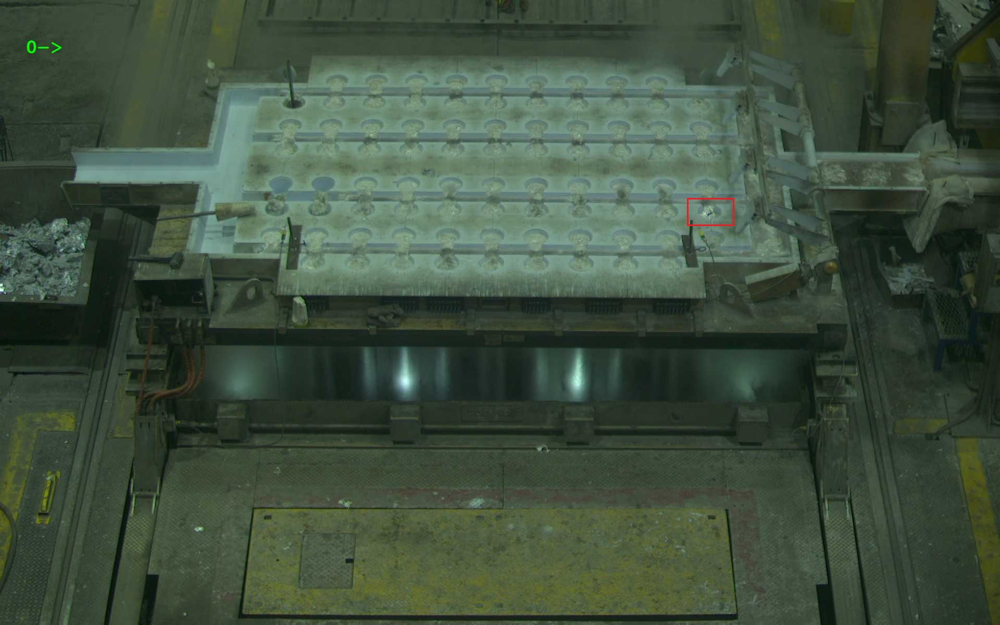

# ДЗ 1. Байесовская генерация и автоэнкодеры

## 1. Байесовский генератор стилей

Испльзуя данные о популярных стилях из файла styles.py написать генератор (можно в виде функции, можно ввите класа [generator](https://wiki.python.org/moin/Generators)):
1. Использует данные о стилях
2. На основе формулы MLE и формулы Байеса о полной вероятности генерировать случайный стиль
3. Так же вернуть вероятность генерации данного стиля
4. Используя в качестве фичей пиксели изображений аватаров (см папку avatars) написать генератор изображений, который генерирует новый аватар
5. Генератор выбирает значение каждого канала каждого пикселя используя распределение вероятностей, полученных на основе изображений avatars; генерация так же осуществляется с помощью MLE
6. Выложить в репозиторий 5 сгенерированных аватаров

## 2. Байесовский генератор стилей

### Датесет

Данные - вырезанные изображения лунок в которые льют металл.

[Ссылка на даасет](https://drive.google.com/file/d/1DHuQ3DBsgab6NtZIZfAKUHS2rW3-vmtb/view?usp=sharing)

```
dataset
├── proliv  # изображения с проливами
|       ├── 000.jpg
│       ├── 001.jpg
│       │   └── ...
|
├── test  # тестовая выборка где перемешаны проливы и не_проливы
│       ├── imgs
│       │   ├── 000.jpg
│       │   ├── 001.jpg
│       │   └── ...
│       └── test_annotation.txt
|
├── train  #  обучающая выборка из не_проливов
|       ├── 000.jpg
│       ├── 001.jpg
│       └── ...
```

### План рещения

1. Имплементировать или найти автоэкодер (можно для старта взять пример из лекции по автоэнкодерам)
2. Обучаем автоэнкодер на не_проливах (dataset\train)
3. Если через такой автоэнкодер прогнать изображение пролива, то MSE между входным изображением и выходным будет больше, чем если прогнать изображение без пролива. Следовательно, если определить некторое пороговое значение MSE, можно классифицировать изображение на классы пролив\не_пролив. Если MSE между входной картинкой и выходной больше фиксированного порога, то на изображении пролив.
4. В качестве loss функции используем MSE (как минимум для baseline)
5. Для определения порога используем изображения из dataset\proliv
6. Пишем метод классификации лунок
7. На изображениях из dataset\test тестируем качество. Считаем True_positive_rate и True_negative_rate.

ВНИМАНИЕ!!!
Для прошедших курс Обработка и генерация изображений для решения использовать архитектуру [MNAD](https://github.com/cvlab-yonsei/MNAD)
1. Обучить
2. Визуализировать кластеры скрытого пространства
