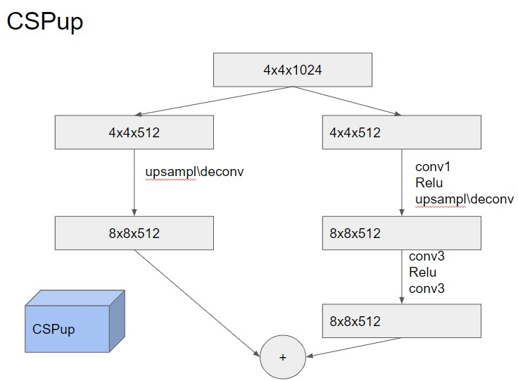

# ДЗ 1. Имплементация GAN

1. Скачать датасет [CelebA](https://mmlab.ie.cuhk.edu.hk/projects/CelebA.html) (можно через [pytorch](https://pytorch.org/vision/stable/generated/torchvision.datasets.CelebA.html))
2. Имплементировать CSPup блок (5 баллов)

3. Имплементировать генератор GAN по заданной архитектурной схеме (10 баллов)

4. Обучить имплементированный GAN (5 баллов)
5. Добиться схдимости (регуляризации, изменение архитектуры, фишки с train loop) (10 баллов)
