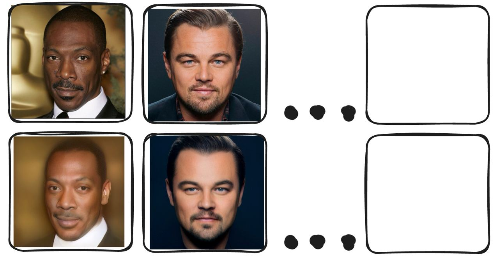
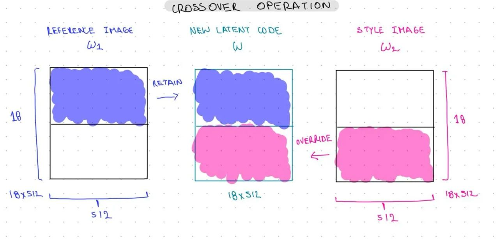

# ДЗ 3. Sampling в латентном пространстве StyleGAN

Для ДЗ надо взять **4-6 персонажей**, в наборе должны быть хотя бы 2 фото с разными поворотами головы помимо смотрящих прямо

## Подготовительные работы:
#### Первый пункт отчета
- Кадрировать изображения для соответствия данным из трейна, блок (Align images)
- Найти проекции изображений в пространстве StyleGAN, методами из ноутбука (советую добавить scheduler, поиграться с весами лоссов или использовать свои, если они улучшают качество)
- результат представить как таблицу оригинал и проекция, написать каким образом были получены, encoder, оптимизация, лоссы и тд

## Style transfer

- Изменяется цвет, свет, текстура, но человек должен остаться прежним
- пробуем самый простой метод для трансфера стиля с одного лица на другой с помощью смешивания векторов, хватит трех стилей (еще три изображения помимо базовых,не забывайте, что стили тоже надо спроецировать в латентное пространство)
- результат в виде таблицы с пояснениями какие брали индексы из вектора W+

Пример стиля

## Expression Transfer

- Три любые эмоции по аналогии с предыдущими пунктами
- Результат в таблицу

## Face swap
- В блоке Homework в ноутбуке, уже написан Arcface лосс (веса модели по ссылке) добавить его в пайплайн оптимизации и попробовать с помощью оптимизации градиента перенести личность с одной фотографии на другую сохраняя при этом угол поворота и цвет для исходного лица.
- сделать табличку пересадки лиц каждого с каждым

