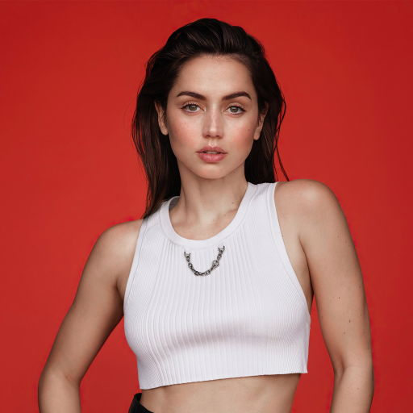
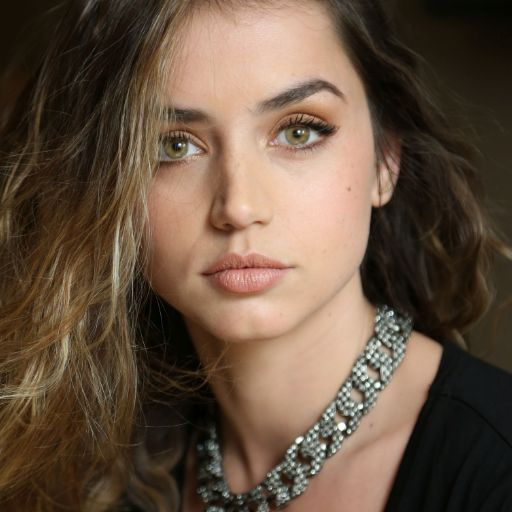
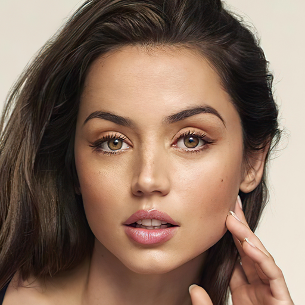
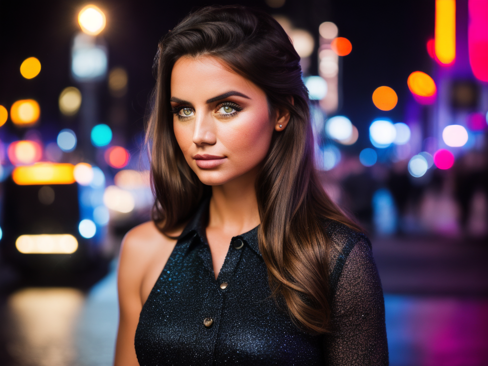
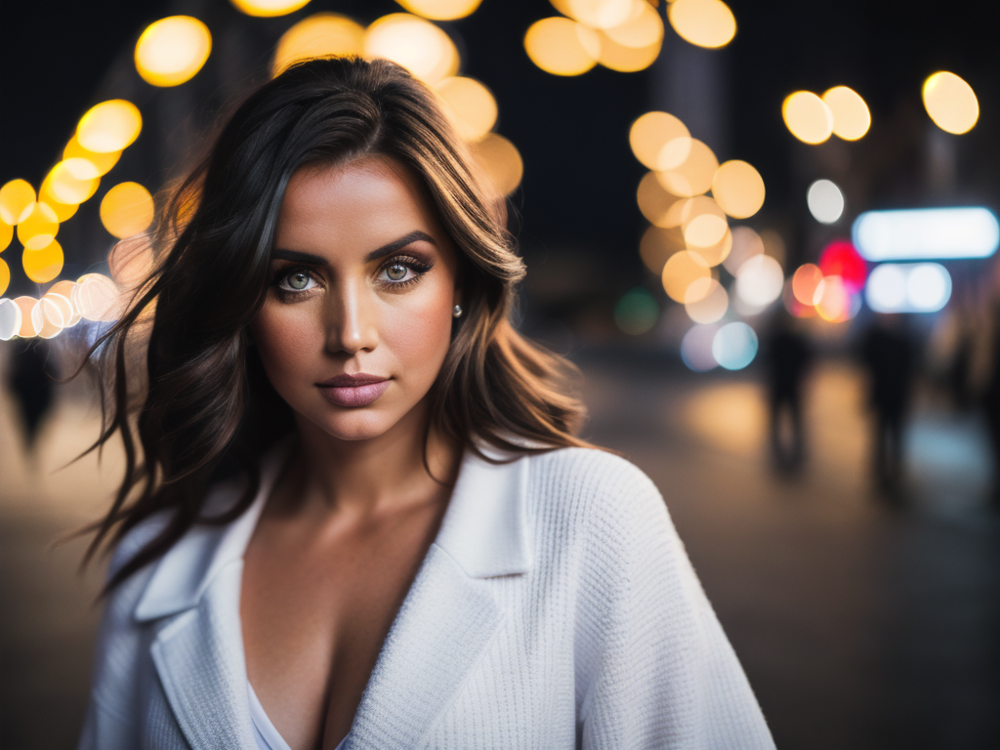

# ДЗ 4. Обучение Stable diffusion 1.5 методом Dreambooth

https://huggingface.co/docs/diffusers/training/dreambooth

#### Идея Dreambooth
text to image модель генерирует изображения по какому-то распределению, например по запросу **a photo of woman face**, модель генерирует фотографию рандомной женщины. Мы хотим сгенерировать фотографию конкретной женщины, фотографий которой не было датасета при обучении модели, но если обучать модель на небольшом наборе, то неизбежно будем терять уже имеющие знания модели. Dreambooth отчасти решает эту проблему обучая модель в два этапа, на нашем датасете **instance images** и на регулязационном датасете **class images** который собирается из генераций модели. 

### 1. Собрать датасет от 15 изображений одно персонажа (чем больше и разнообразнее тем лучше будет качество)

### 2. Кропнуть и заресайзить лица, тут можно обрабатывать сразу все https://www.birme.net/

### 3. Скачать предобученный чекпоинт SD1.5 с [civitai.com](https://civitai.com/) 

Мы будем использовать библиотеку diffusers и их скрипты для обучения. Чтобы генерации получались более красивые, будем брать предобученные модели с сайта civitai. Формат весов в нем отличается и туда вкладывают только unet поэтому сначала модель нужно конвертировать в формат diffusers 

### 4. Обучить Stable diffusion 1.5.

##### Параметры 
 **--instance_prompt="a photo of sks woman face"** токен на который мы хотим обучить персонажа  

**--class_prompt="a photo of woman face"** промт для регуляризации

Чтобы не было language drift (когда модель уже содержит знания в каком-то из токенов) мы используем токен sks он был выбран авторами статьи как один и наименее частотных в датасете. 

--instance_data_dir=$INSTANCE_DIR 

--class_data_dir=$CLASS_DIR

Чтобы модель не забывала уже то, что знает и не переобучалась используется регуляризационный датасет (class images он генерируется автоматически по промту class_prompt, чтобы изображения были более качественные можете самостоятельно собрать этот набор). 

### Пример генераций в 768х1024

### 5.При успехе обучения чекпоинта целиком, обучить LoRA модель ссылка на скрипт в ноутбуке 

