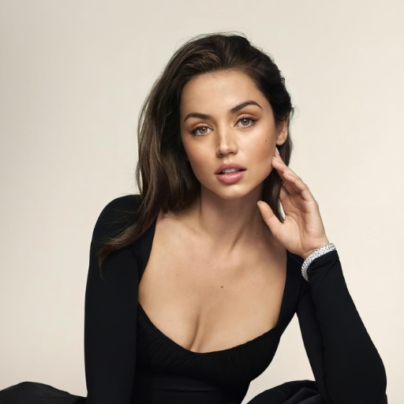
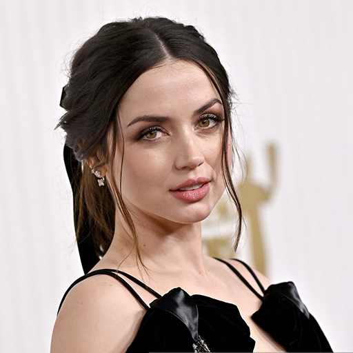

# ДЗ 4. Обучение Stable diffusion 1.5 методом Dreambooth

https://huggingface.co/docs/diffusers/training/dreambooth

#### Идея Dreambooth
text to image модель генерирует изображения по какому-то распределению, например по запросу **a photo of woman face**, модель генерирует фотографию рандомной женщины. Мы хотим сгенерировать фотографию конкретной женщины, фотографий которой не было датасета при обучении модели, но если обучать модель на небольшом наборе, то неизбежно будем терять уже имеющие знания модели. Dreambooth отчасти решает эту проблему обучая модель в два этапа, на нашем датасете **instance images** и на регуляризационном датасете **class images** который собирается из генераций модели.

### 1. Собрать датасет от 15 изображений одно персонажа (чем больше и разнообразнее тем лучше будет качество)

### 2. Кропнуть и заресайзить лица, тут можно обрабатывать сразу все https://www.birme.net/

Для лучшего качества и вариативности лучше брать изображения с разным размером кадра от close-up до medium см. Таблица 1, соотношение можно взять 1 к 1.

Если в трэйне будут только крупные лица то при генерации вряд ли получится хороший средний или крупный план.

Таблица 1. Пример изображений для обучения

### 3. Скачать предобученный чекпоинт SD1.5 с [civitai.com](https://civitai.com/)

Мы будем использовать библиотеку diffusers и их скрипты для обучения. Чтобы генерации получались более красивые, будем брать предобученные модели с сайта civitai. Формат весов в нем отличается и туда вкладывают только unet поэтому сначала модель нужно конвертировать в формат diffusers

### 4. Обучить Stable diffusion 1.5.

##### Параметры
**--instance_prompt="a photo of sks woman face"** токен на который мы хотим обучить персонажа 

**--class_prompt="a photo of woman face"** промт для регуляризации

Чтобы не было language drift (когда модель уже содержит знания в каком-то из токенов) мы используем токен sks он был выбран авторами статьи как один и наименее частотных в датасете.

--instance_data_dir=$INSTANCE_DIR

--class_data_dir=$CLASS_DIR

Чтобы модель не забывала уже то, что знает и не переобучилась используется регуляризационный датасет (class images генерируется автоматически по промту class_prompt), чтобы изображения были более качественные можете самостоятельно собрать этот набор).

**! В примере из ноутбука я отдельно собрал class images (добавил negative promt и заменил prompt) чтобы размер кадра больше соответствовал примерам из обучения и картинки были более качественные и разнообразные, а не только крупный план лица.**

### Пример генераций в 768х1024

### 5. Обучить LoRA модель

При успехе обучения чекпоинта целиком, обучить LoRA модель. Ссылка на скрипт обучения и функцию загрузки весов в пайплайн есть в ноутбуке DreamBooth_Stable_Diffusion.ipynb.

Провести 3 эксперимента по подбору размера LoRa (параметр --rank) Смотрим как размер модели влияет на количество итераций и итоговое качество. В readme добавить варианты генерации по каждой из моделей.

### 6. Сравнить лучший чекпоинт Unet и Lora
Один лучший чекпоинт обучения Unet и Одна лучшая LoRA модель

### 7. ControlNet
Генерация любого варианта Controlnet из ноутбука, для обученных Unet и Lora

# Итог:
- Собрать датасет и обучить Unet - 10 баллов
- Обучить Lora модель и сравнить с Unet 15 баллов
- Добавить в pipeline ControlNet - 5 баллов

## Как правильно сравнивать модели !
Брать одинаковые промты, обязательно фиксировать seed и batch чтобы было явно видно как влияет количество параметров. Для теста брать 5 промтов! 

Собираем набор промтов с разным окружением (пустыне, городе, пляже, луне и т.д, что угодно) чтобы было видно, что модель не переобучилась и в состоянии генерировать разнообразные сэмплы.

